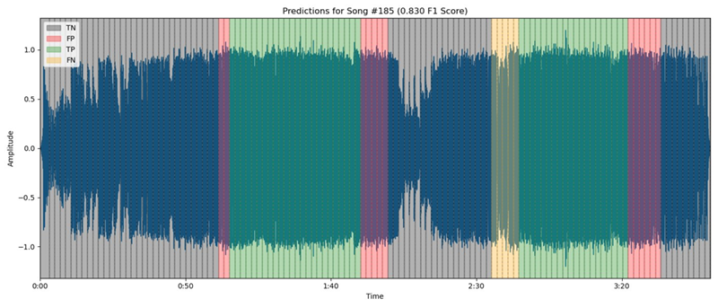

# Automated Chorus Detection

## Project Overview

A Convolutional Recurrent Neural Network (CRNN) trained on 332 annotated songs is used to make binary predictions of whether a meter in a song belongs to a chorus or not, achieving an F1 score of 0.876 (Precision: 0.884, Recall: 0.869) on an unseen testset of 50 songs. This repository contains various Python notebooks, scripts, and resources that support the end-to-end data science process for chorus detection, including data collection, exploratory data analysis, digital signal processing techniques, and modeling. Additionally, it includes a user-friendly command-line tool that leverages the audio processing pipeline and pre-trained CRNN model to predict chorus locations in songs from YouTube links.

### Data

The dataset consists of 332 manually labeled songs, predominantly from electronic music genres. The data wrangling steps included:

- **Audio preprocessing** - formatting songs uniformly, processing at consistent sampling rate, trimming silence, extracting metadata using Spotify's API. [See Jupyter Notebook](notebooks/Preprocessing.ipynb)
- **Manual chorus labeling** - label start/end timestamp of choruses, skipping ambiguous songs. More details on the annotation process can be found in the [Mixin Annotation Guide](docs/Mixin%20Data%20Annotation%20Guide.pdf)

### Exploratory Data Analysis

The EDA aimed to uncover insights and patterns to inform model development. First, we examined the distribution of chorus labels across out dataset and how choruses might differ from non-choruses. Audio features pertaining to the spectral, rhythmic, tonal, and energy properties of music were extracted, quantified, and visualized to better understand the characteristics of music that are relevant to the task of chorus detection. Below are examples of audio feature visualizations of a song with 3 choruses (highlighted in green).


More details on the EDA process can be found in the following notebooks:  

- [EDA Part 1](notebooks/Mixin_EDA.ipynb): Label distribution, label validity, A/B testing of feature extraction methods, audio feature visualization
- [EDA Part 2](notebooks/EDA_V2.ipynb): Finding optimal number of components for decomposing audio features, quantifying audio features and comparing between chorus vs. non-chorus

### Model Preprocessing

- Extracted features include Root Mean Squared energy, key-invariant chromagrams, Melspectrograms, MFCCs, and tempograms. The latter four features are decomposed using Non-negative Matrix Factorization with their optimal number of components derived during EDA.
- Songs are segmented into timesteps based on musical meters (computed using tempo and time-signature). This introduces an inductive bias to help the CRNN learn more relevant features and patterns.
- Positional encoding is applied to every meter in a song and every audio frame in a meter. 
- Songs and labels are uniformly padded and split into train/validation/test sets. Data is processed into batch sizes of 32 using a custom generator. 

### Modeling

The CRNN model consists of:

- Three 1D convolutional layers with ReLU and max-pooling to extract local patterns
- A Bidirectional LSTM layer to model long-range temporal dependencies
- A TimeDistributed Dense output layer with sigmoid activation for meter-wise predictions

``` python
def create_crnn_model(max_frames_per_meter, max_meters, n_features):
    """
    Args:
    max_frames_per_meter (int): Maximum number of frames per meter.
    max_meters (int): Maximum number of meters.
    n_features (int): Number of features per frame.
    """
    frame_input = layers.Input(shape=(max_frames_per_meter, n_features))
    conv1 = layers.Conv1D(filters=128, kernel_size=3, activation='relu', padding='same')(frame_input)
    pool1 = layers.MaxPooling1D(pool_size=2, padding='same')(conv1)
    conv2 = layers.Conv1D(filters=256, kernel_size=3, activation='relu', padding='same')(pool1)
    pool2 = layers.MaxPooling1D(pool_size=2, padding='same')(conv2)
    conv3 = layers.Conv1D(filters=256, kernel_size=3, activation='relu', padding='same')(pool2)
    pool3 = layers.MaxPooling1D(pool_size=2, padding='same')(conv3)
    frame_features = layers.Flatten()(pool3)
    frame_feature_model = Model(inputs=frame_input, outputs=frame_features)

    meter_input = layers.Input(shape=(max_meters, max_frames_per_meter, n_features))
    time_distributed = layers.TimeDistributed(frame_feature_model)(meter_input)
    masking_layer = layers.Masking(mask_value=0.0)(time_distributed)
    lstm_out = layers.Bidirectional(layers.LSTM(256, return_sequences=True))(masking_layer)
    output = layers.TimeDistributed(layers.Dense(1, activation='sigmoid'))(lstm_out)
    model = Model(inputs=meter_input, outputs=output)
    model.compile(optimizer='adam', loss=custom_binary_crossentropy, metrics=[custom_accuracy])
    return model
```

### Training

- Custom loss and accuracy functions handle padded values
- Callbacks to save best model based on minimal validation loss, reduce learning rate on plateau, and early stopping
- Trained for 50 epochs (stopped early after 18 epochs). Training/Validation Loss and Accuracy plotted below:


## Results

The model achieved strong results on the held-out test set as shown in the summary table. Visualizations of the predictions on sample test songs are also provided and can be found in the [test_predictions folder](images/test_predictions).

| Metric         | Score  |
|----------------|--------|
| Loss           | 0.278  |
| Accuracy       | 0.891  |
| Precision      | 0.831  |
| Recall         | 0.900  |
| F1 Score       | 0.864  |


## Limitations, Implications, and Future Directions

While the model demonstrates promising results, it's important to note limitations such as its potential biases towards the predominantly electronic music genre in the dataset. Future work could explore the application of semi-supervised learning techniques to leverage unlabeled data, expand the dataset to include a wider variety of genres, and explore alternative architectures or attention mechanisms that could further enhance model performance, generalizeability, and interpretability. More empirical testing is needed to determine whether the hierarchical positional encoding and segmentation techniques are effective.

## Project Documentation and Resources

- **Final Project Write-up**: For a more in-depth analysis, see the [Final Project Write-up](docs/Capstone_Final_Report.pdf).

- **Data Annotation**: Details on the manual song labeling process are in the [Mixin Data Annotation Guide](docs/Mixin%20Data%20Annotation%20Guide.pdf).

- **Model Metrics**: Key performance metrics for the CRNN model are summarized in the [model_metrics.csv](docs/model_metrics.csv).

- **Notebooks**:
  - [Preprocessing](notebooks/Preprocessing.ipynb): Audio formatting, trimming, metadata extraction
  - [EDA](notebooks/Mixin_EDA.ipynb): Exploratory analysis and visualizations of audio features
  - [Modeling](notebooks/Automated-Chorus-Detection-V2.ipynb): CRNN model preprocessing, architecture, training, evaluation

## Setup and Running the CLI


### Step 1: Clone the Repository

```bash
git clone https://github.com/dennisvdang/chorus-detection.git
cd chorus-detection
```

### Step 2: Environment Setup

#### Using virtualenv:

```bash
pip install virtualenv
virtualenv venv
# Windows
venv\Scripts\activate
# MacOS/Linux
source venv/bin/activate
```

#### Using conda:

```bash
conda create --name myenv python=3.8
conda activate myenv
```

### Step 3: Install Dependencies

```bash
pip install -r requirements.txt
```

### Step 4: Install FFmpeg

#### Windows:

- Download from https://ffmpeg.org/download.html, extract, and add to PATH.

#### MacOS:

```bash
brew install ffmpeg
```

#### Linux:

```bash
sudo apt update
sudo apt install ffmpeg
```

### Step 5: Run the Script

```bash
python src/chorus_finder.py --url "https://www.youtube.com/watch?v=example"
```

## Setup and Running the CLI Using Makefile

This project includes a `Makefile` to simplify the setup and execution process. Below are the steps to use the `Makefile` to run the CLI.

### Step 1: Clone the Repository

```bash
git clone https://github.com/dennisvdang/chorus-detection.git
cd chorus-detection
```

### Step 2: Setup Environment and Install Dependencies

Run the following command to set up the Python environment and install all necessary dependencies:

```bash
make setup
```

This command will create a virtual environment, activate it, and install the dependencies listed in `requirements.txt`.

### Step 3: Install FFmpeg

FFmpeg is required for handling audio processing. Install it according to your operating system:

#### Windows:
- Download from https://ffmpeg.org/download.html, extract, and add to PATH.

#### MacOS:
```bash
brew install ffmpeg
```

#### Linux:
```bash
sudo apt update
sudo apt install ffmpeg
```

### Step 4: Run the Script

To run the `chorus_finder.py` script using the `Makefile`, use the following command, replacing `"https://www.youtube.com/watch?v=example"` with the actual YouTube URL:

```bash
make run URL="https://www.youtube.com/watch?v=example"
```

This command will execute the script with the specified URL.

### Step 5: Clean Up

To clean up the environment and remove temporary files, you can use:

```bash
make clean
```
