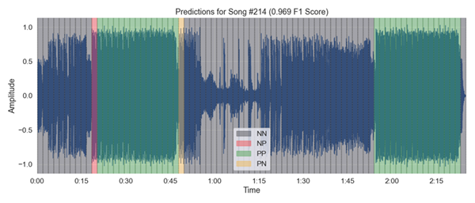
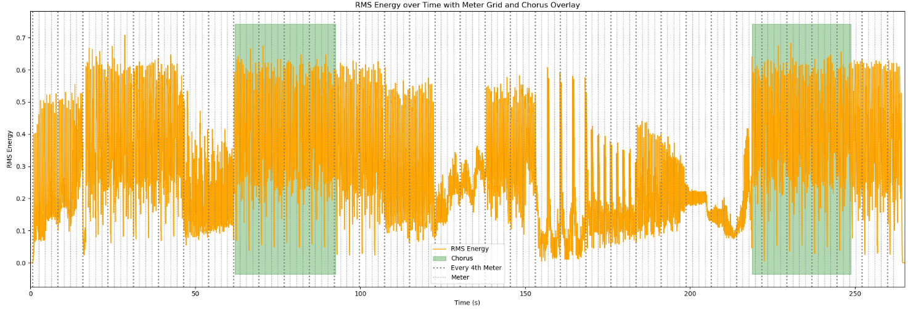
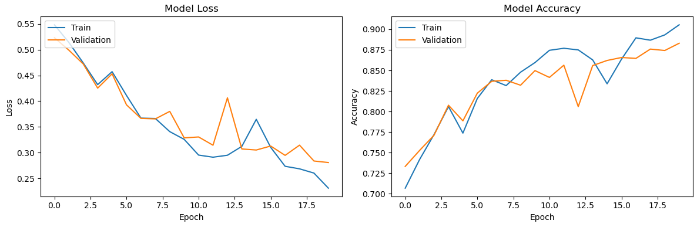

# Automated Chorus Detection


## Introduction

This project leverages machine learning techniques used in Digital Signal Processing, Music Information Retrieval, and Data Science to predict chorus locations in songs. Specifically, I employ a Convolutional Recurrent Neural Network (CRNN), alongside a novel approach to capture the intricate structure of musical compositions that resulted a test accuracy of 89.9% and F1 score of .876. This is part of a larger **Mixin** project in development, where the goal is to build a fully autonomous system that can generate mixes/mixtapes from a music playlist. Various applications of audio segmentation like this have the potential to enhance music recommendation systems and music discovery processes where the "highlights" of a song can be identified more efficiently.

## Table of Contents
- [Introduction](#introduction)
- [Data Preprocessing](#data-preprocessing)
  - [Data Loading](#data-loading)
  - [Feature Extraction](#feature-extraction)
  - [Hierarchical Positional Encodings](#hierarchical-positional-encodings)
  - [Feature Concatenation](#feature-concatenation)
  - [Preprocessing Code Overview](#preprocessing-code-overview)
  - [Data Padding](#data-padding)
  - [Data Splitting and Dataset Creation](#data-splitting-and-dataset-creation)
- [Modeling](#modeling)
  - [Initial CRNN Model Architecture](#initial-crnn-model-architecture)
  - [Custom Loss and Accuracy Functions](#custom-loss-and-accuracy-functions)
  - [Model Checkpoints](#model-checkpoints)
  - [Model training](#model-training)
- [Results](#results)

## Data Preprocessing

- **Dataset**: The dataset, comprising 332 labeled songs, is loaded and features extracted mainly using the python library Librosa. The songs were manually annotated to record the start and end times of choruses in a mostly electronic music genre dataset. More details on the annotation process can be found in the [Mixin Annotation Guide](Mixin%20Data%20Annotation%20Guide.pdf).

### Features: 
- Key features extracted from the audio include Mel spectrogram, Key-invariant Chromagram, MFCCs, Root Mean Squared Energy, and Tempogram. 
- The Mel spectrograms, chromagrams, MFCCs, and Tempograms were decomposed using Non-negative Matrix Factorization and their activations used as features. 
- **Meter-based segmentation**: The temporal structure of songs are also captured through estimations of tempos and time signature (extracted from Spotify API), beat tracking, and meter alignment. By aligning the input data to the musical meter structure, we are essentially introducing an inductive bias into the model. This bias can help the CRNN learn features and patterns that are more relevant to the task of chorus detection, as the model is now aware of the underlying musical structure. Segmenting the data into meters can also improve the computational efficiency of the CRNN model. Instead of processing the entire song at once, the model can focus on processing each meter independently, potentially reducing the overall computational load and memory requirements. Below is an example of what meter-based segmentation looks like over an audio feature and labeled chorus.



- **Hierarchical Positional Encodings**: In an effort to capture the intricate structure of music, I improvised a novel approach of hierarchical positional encoding. This simple, but intuitive, encoding scheme is hypothesized to enrich the model's input features with two layers of contextual information:
  1. **Meter-level Encoding**: This layer embeds the position of each musical meter within a song, reflecting the macro-structure of musical compositions such as a verse, chorus, or bridge. By understanding the sequential arrangement of these segments, the model gains insights into the progression and dynamics of a song, which seems crucial, at least for humans, for identifying chorus sections accurately.
  2. **Frame-level Encoding**: At a more granular level, this encoding embeds the position of each frame within its respective meter, offering the model a detailed temporal context. This fine-grained information could allow the model to discern subtle rhythmic and melodic variations within meters.

The hierarchical nature of these encodings mirrors the hierarchical structure of music itself, from the broad arrangement of sections down to the timing of individual notes. While the predetermined kernel size may limit the model's ability to learn certain spatial-temporal patterns, the hierarchical positional encoding and the inductive bias introduced by the meter-level segmentation can still provide valuable information that the CRNN can leverage to improve its chorus detection performance. Ultimately, the effectiveness of this approach would need to be empirically evaluated and compared to alternative approaches, such as using a fixed kernel size with varying degrees of segmentation. The tradeoffs between computational efficiency, model complexity, and overall performance should also be carefully considered.

```python
def positional_encoding(position, d_model):
    """Generate a positional encoding for a given position and model dimension."""
    angle_rads = (
        np.arange(position)[:, np.newaxis] /
        np.power(10000, (2 * (np.arange(d_model)[np.newaxis, :] // 2)) / np.float32(d_model))
    )
    return np.concatenate([np.sin(angle_rads[:, 0::2]), np.cos(angle_rads[:, 1::2])], axis=-1)


def apply_hierarchical_positional_encoding(segments):
    """Apply positional encoding at the meter and frame levels to a list of segments."""
    n_features = segments[0].shape[1]
    measure_level_encodings = positional_encoding(len(segments), n_features)
    return [
        seg + positional_encoding(len(seg), n_features) + measure_level_encodings[i] 
        for i, seg in enumerate(segments)
    ]
```
- **Feature Concatenation**: After transformations, the data is in the shape: `[time_frames, sum_of_feature_dimensions]` where the sum of feature dimensions in this implementation is `1 + 4 + 3 + 3 + 13 + 12 = 36`, leading to a combined shape of `[audio_frames, 36]`. After the data is partitioned into musical meters, the entire dataset can be conceptualized as a 3D array of `[n_songs, n_segments, 36]`, where `n_segments` varies per song and may require additional padding for consistent processing.

## Preprocessing Code Overview
```python
TARGET_SR = 12000 # Target sample rate chosen to be 1/4 of the original 48kHz.
HOP_LENGTH = 128  # Hop length for short-time Fourier transform. Hop length of 128 at 12kHz gives a similar frame rate to a hop length of 512 at 48kHz.

# Load the audio file
audio_path = f'../data/audio_files/processed/{song_id}.mp3'
y, _ = librosa.load(audio_path, sr=TARGET_SR)

# Harmonic-percussive source separation
y_harm, y_perc = librosa.effects.hpss(y)

# Compute RMS energy from spectrogram to give a more accurate representation of energy over time because its frames can be windowed
S = np.abs(librosa.stft(y, hop_length=HOP_LENGTH))
rms = librosa.feature.rms(S=S)

# Compute Mel Spectrogram and decompose into 4 components (4 chosen from EDA)
mel = librosa.feature.melspectrogram(y=y, sr=TARGET_SR, n_mels=128, hop_length=HOP_LENGTH)
mel_acts = librosa.decompose.decompose(mel, n_components=4, sort=True)[1]

# Compute chromagram, make it key invariant, and decompose 
chromagram = librosa.feature.chroma_cqt(y=y_harm, sr=TARGET_SR, hop_length=HOP_LENGTH)
chroma_ki = make_key_invariant(chromagram)
chroma_acts = librosa.decompose.decompose(chroma_ki, n_components=3, sort=True)[1]

# Compute tempogram, ensure non-negative b/c tempograms are finicky, and decompose 
onset_env = librosa.onset.onset_strength(y=y_perc, sr=TARGET_SR, hop_length=HOP_LENGTH)
tempogram = np.clip(librosa.feature.tempogram(onset_envelope=onset_env, sr=TARGET_SR, hop_length=HOP_LENGTH), 0, None)
tempogram_acts = librosa.decompose.decompose(tempogram, n_components=3, sort=True)[1]

# Compute MFCCs
mfccs = librosa.feature.mfcc(y=y, sr=TARGET_SR, n_mfcc=13, hop_length=HOP_LENGTH)

# Calculate dimensions, total inverse dimension, and weights
features = [rms, mel_acts, chroma_ki, chroma_acts, tempogram_acts, mfccs]
feature_names = ['rms', 'mel_acts', 'chroma_ki', 'chroma_acts', 'tempogram_acts', 'mfccs']

# Calculate dimensions and weights
dims = {name: feature.shape[0] for feature, name in zip(features, feature_names)}
total_inv_dim = sum(1.0 / dim for dim in dims.values())
weights = {name: 1.0 / (dims[name] * total_inv_dim) for name in feature_names}

# Standardize and apply weights
standardized_weighted_features = [StandardScaler().fit_transform(feature.T).T * weights[name]
                                    for feature, name in zip(features, feature_names)]

# Stack/concat features
combined_features = np.concatenate(standardized_weighted_features, axis=0).T

# Tempo and beat tracking
tempo, beats = librosa.beat.beat_track(onset_envelope=onset_env, sr=TARGET_SR, hop_length=HOP_LENGTH)
beat_times = librosa.frames_to_time(beats, sr=TARGET_SR, hop_length=HOP_LENGTH)
data = df.loc[df['SongID'] == song_id]
bpm = data['sp_tempo'].fillna(tempo).replace(0, tempo).clip(lower=70, upper=140).values[0]
time_signature = int(data['sp_time_signature'].fillna(4).replace(0, 4).values[0])
beat_interval_in_frames = librosa.time_to_frames(60/bpm, sr=TARGET_SR, hop_length=HOP_LENGTH)

# Measure grid creation and label alignment
anchor_frame = find_anchor_frame(beats, bpm, TARGET_SR, HOP_LENGTH)
beat_grid, meter_grid = create_beat_grid(beats, anchor_frame, beat_interval_in_frames, time_signature, len(combined_features))
aligned_labels = generate_and_align_labels(data, len(combined_features), meter_grid)
meter_segments = segment_data_measures(combined_features, meter_grid)

# Apply Hierarchical Positional Encoding
encoded_segments = apply_hierarchical_positional_encoding(meter_segments)
```

### Data Padding

The CRNN model requires uniformly structured input for the convolutional layers. Given the inherent variability in song lengths and structures, I employed padding on both the meters and frames. Each meter was padded to have the same amount of frames in any given meter. And every song was padded to have the same amount of meters. This padding process ensure that the model can process songs of varying lengths without bias. Additionally, label sequences are padded with a special value (-1) to match the length of the padded song structures. Once masking is applied, this special value indicates to the model that these segments are not part of the original song data and should be ignored in the loss and accuracy functions.

#### Final Data Shape/Structure
- The final shape after padding is `[n_songs, max_segments, max_segment_time_frames, 36]`, with `max_segments` and `max_segment_time_frames` being the maximum numbers of meters per song and the maximum frames per meter across the dataset, respectively.

### Data Splitting and Dataset Creation

- The dataset, consisting of padded songs and their corresponding labels, is divided into training, validation, and test sets at 70/15/15 splits. 
- Data is further processed into batches. Batches are dynamically generated using a custom data generator and turned into tensors using TensorFlow's `Dataset` API. These datasets are optimized for performance, supporting parallel data processing and prefetching.

## Modeling

The core of this automated chorus detection system is the Convolutional Recurrent Neural Network (CRNN) model, designed to capture both the temporal dynamics and the intricate patterns present in musical compositions. 

### Initial CRNN Model Architecture

- **Input Layer**: Receives the preprocessed and standardized feature arrays, segmented by meter and frame.
- **Convolutional Layers**: Three convolutional layers, each followed by max pooling, extract hierarchical features from the input data, capturing various aspects of the musical signal.
- **Recurrent Layer**: A bidirectional LSTM layer processes the time-distributed frame features, enabling the model to understand long-term dependencies and temporal patterns in the song data.
- **Output Layer**: A time-distributed dense layer with a sigmoid activation function makes binary predictions for each segment/meter, indicating the presence or absence of a chorus.
- **Model Compilation**: The model is compiled with the Adam optimizer, utilizing the custom binary cross-entropy function for loss and including the custom accuracy metric for performance evaluation.

``` python
def create_crnn_model(max_frames_per_measure, max_measures, feature_per_frame):
    """
    Args:
    max_frames_per_measure (int): Maximum number of frames per measure.
    max_measures (int): Maximum number of measures.
    feature_per_frame (int): Number of features per frame.
    """
    frame_input = layers.Input(shape=(max_frames_per_measure, feature_per_frame))
    conv1 = layers.Conv1D(filters=128, kernel_size=3, activation='relu', padding='same')(frame_input)
    pool1 = layers.MaxPooling1D(pool_size=2, padding='same')(conv1)
    conv2 = layers.Conv1D(filters=256, kernel_size=3, activation='relu', padding='same')(pool1)
    pool2 = layers.MaxPooling1D(pool_size=2, padding='same')(conv2)
    conv3 = layers.Conv1D(filters=256, kernel_size=3, activation='relu', padding='same')(pool2)
    pool3 = layers.MaxPooling1D(pool_size=2, padding='same')(conv3)
    frame_features = layers.Flatten()(pool3)
    frame_feature_model = Model(inputs=frame_input, outputs=frame_features)

    measure_input = layers.Input(shape=(max_measures, max_frames_per_measure, feature_per_frame))
    time_distributed = layers.TimeDistributed(frame_feature_model)(measure_input)
    masking_layer = layers.Masking(mask_value=0.0)(time_distributed)
    lstm_out = layers.Bidirectional(layers.LSTM(256, return_sequences=True))(masking_layer)
    output = layers.TimeDistributed(layers.Dense(1, activation='sigmoid'))(lstm_out)
    model = Model(inputs=measure_input, outputs=output)
    model.compile(optimizer='adam', loss=custom_binary_crossentropy, metrics=[custom_accuracy])
    return model
```
#### Custom Loss and Accuracy Functions

To accommodate the use of padding to standardize input lengths, we employ custom functions for calculating loss and accuracy to ignore padded values (labeled as -1) in the loss calculation, ensuring that the model's learning is focused on meaningful data segments only.

```python
def custom_binary_crossentropy(y_true, y_pred):
    """Custom binary cross-entropy loss to handle -1 labels, which are used for padding and should be ignored during loss calculation."""
    y_true = tf.cast(y_true, tf.float32)
    bce = tf.keras.backend.binary_crossentropy(y_true, y_pred)
    mask = tf.cast(tf.not_equal(y_true, -1), tf.float32)
    loss = bce * mask
    return tf.reduce_sum(loss) / tf.reduce_sum(mask)

def custom_accuracy(y_true, y_pred):
    """Custom accuracy metric to handle -1 labels, which are used for padding and should be ignored during accuracy calculation."""
    mask = tf.cast(tf.not_equal(y_true, -1), tf.float32)
    correct_predictions = tf.equal(tf.cast(tf.round(y_pred), tf.float32), y_true)
    masked_correct_predictions = tf.cast(correct_predictions, tf.float32) * mask
    accuracy = tf.reduce_sum(masked_correct_predictions) / tf.reduce_sum(mask)
    return accuracy
```

### Model Checkpoints

To optimize the training process, we utilize three TensorFlow callbacks:
- **Model Checkpoint**: Saves the best model based on the validation custom loss function.
- **Early Stopping**: Halts training when validation loss ceases to improve for three epochs to prevent overfitting and promote training efficiency.
- **Reduce Learning Rate on Plateau**: Dynamically lowers the learning rate if the validation loss does not improve after two epochs.

### Model training
The model is trained with the callbacks described above over 20 epochs. Below is the plot showing the training history, including both loss and accuracy over the epochs:

```python
def plot_training_history(history):
    plt.figure(figsize=(12, 4))

    # Plot training & validation loss 
    plt.subplot(1, 2, 1)
    plt.plot(history.history['loss'])
    plt.plot(history.history['val_loss'])
    plt.title('Model Loss')
    plt.ylabel('Loss')
    plt.xlabel('Epoch')
    plt.legend(['Train', 'Validation'], loc='upper left')

    # Plot training & validation accuracy values
    plt.subplot(1, 2, 2)
    plt.plot(history.history['custom_accuracy'])  
    plt.plot(history.history['val_custom_accuracy'])  
    plt.title('Model Accuracy')
    plt.ylabel('Accuracy')
    plt.xlabel('Epoch')
    plt.legend(['Train', 'Validation'], loc='upper left')

    plt.tight_layout()
    plt.show()

plot_training_history(history)
```



## Results

The model's performance on the test dataset is summarized below:

| Metric         | Score  |
|----------------|--------|
| Test Loss      | 0.234  |
| Test Accuracy  | 0.899  |
| F1 Score       | 0.876  |

The model's high accuracy and F1 score suggest it is effective at identifying chorus sections within songs. The balance between precision and recall, as indicated by the F1 score, highlights the model's capability to minimize both false positives and false negatives which is crucial for an autonomous DJ system like Mixin.

## Limitations, Implications, and Future Directions
While the model demonstrates promising results, it's important to note limitations such as its potential biases towards the predominantly electronic music genre in the dataset. Future work could explore the application of semi-supervised learning techniques to leverage unlabeled data, expand the dataset to include a wider variety of genres, and explore alternative architectures or attention mechanisms that could further enhance model performance, generalizeability, and interpretability. More empirical testing is needed to determine whether the hierarchical positional encoding and segmentation techniques are effective. 