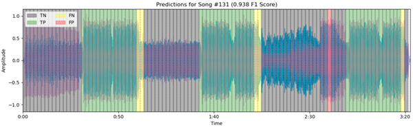
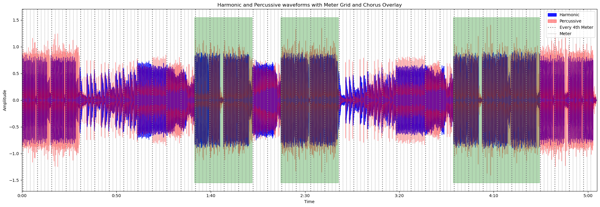
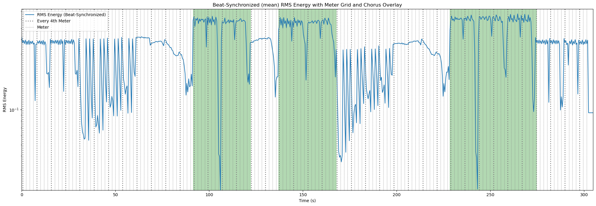
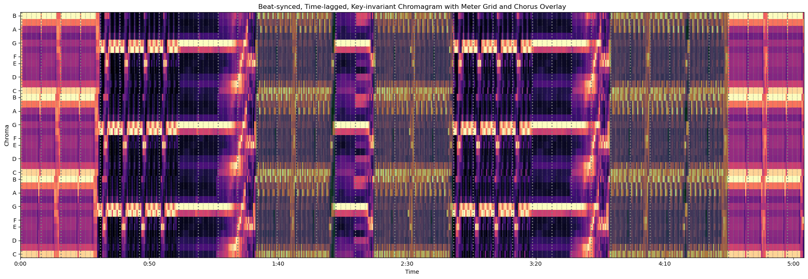
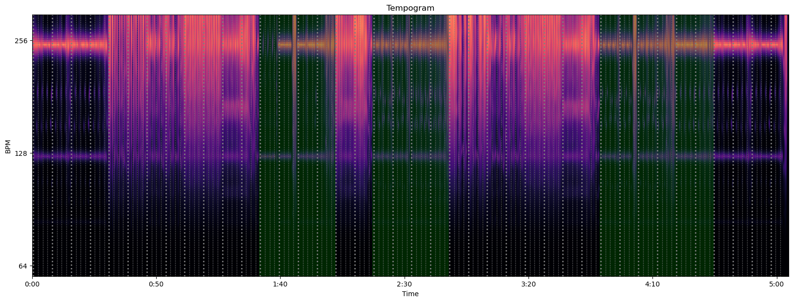
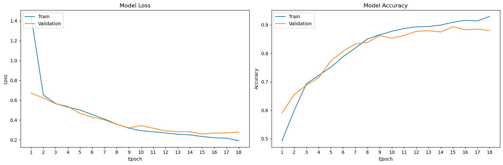
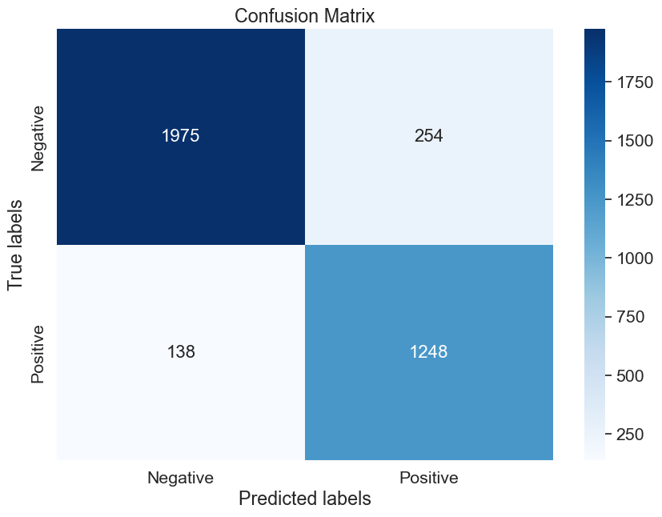

# Automated Chorus Detection



## Project Overview

This project focuses on developing an automated system for detecting choruses in songs using a Convolutional Recurrent Neural Network (CRNN). The model is trained on a custom dataset of 332 annotated songs, predominantly from electronic music genres, and achieved an F1 score of 0.864 (Precision: 0.831, Recall: 0.900) on an unseen test set of 50 songs (albeit from similar genres it was trained on).

If you'd like to see how well the model performs on your favorite songs, head over to the Streamlit app hosted on [HuggingFace](https://huggingface.co/spaces/dennisvdang/Chorus-Detection) or use the [Dockerized command-line tool](#setup-and-running-the-cli-with-docker) that integrates the audio processing pipeline and pre-trained CRNN model to predict chorus locations in songs from YouTube links.

And if you found this project interesting or informative, feel free to ⭐ star the repository! I welcome any questions, criticisms, or issues you may have. Additionally, if you have any ideas for collaboration, don't hesitate to connect with me. Your feedback and contributions are greatly appreciated!

### Future Plans

I have plans to develop a streamlined pipeline for contributors to preprocess and label their own music data to either train their own custom models or add to the existing dataset to hopefully improve the model's generalizability across various music genres. Stay tuned!

## Project Resources

Below, you'll find information on where to locate specific files and their purposes:

- [`data/clean_labeled.csv`](data/clean_labeled.csv): The labeled dataset used to train the CRNN.
- [`notebooks/Automated-Chorus-Detection.ipynb`](notebooks/Automated-Chorus-Detection.ipynb): Main development notebook. Includes the code for the audio signal processing pipeline, CRNN model architecture, training, testing, and prediction visualizations.
- [`notebooks/Preprocessing.ipynb`](notebooks/Preprocessing.ipynb): Covers the audio preprocessing steps to format songs uniformly, trim audio silences, and extract metadata using Spotify's API.
- [`docs/Data_Annotation_Guide.pdf`](docs/Data_Annotation_Guide.pdf): A guide detailing the manual annotation process for labeling choruses in songs.
- [`docs/Capstone_Final_Report.pdf`](docs/Capstone_Final_Report.pdf): A PDF report detailing the end-to-end data science process.
- [`models/CRNN/best_model_V3.h5`](models/CRNN/best_model_V3.h5): The best performing CRNN model trained on the annotated dataset.

## Project Technical Summary

### Data

The dataset consists of 332 manually labeled songs, predominantly from electronic music genres. Data preparation involved:

1. **Audio preprocessing**: Formatting songs uniformly, processing at a consistent sampling rate, trimming silence, and extracting metadata using Spotify's API. [Link to preprocessing notebook](notebooks/Preprocessing.ipynb)

2. **Manual Chorus Labeling**: Labeling the start and end timestamps of choruses following a set of guidelines. More details on the annotation process can be found in the [Annotation Guide pdf.](docs/Data_Annotation_Guide.pdf)

### Model Preprocessing

- **Feature Extraction**: Features such as Root Mean Squared energy, key-invariant chromagrams, Melspectrograms, MFCCs, and tempograms were extracted. These features were decomposed using Non-negative Matrix Factorization using an optimal number of components derived in our exploratory analysis.

- **Segmentation and Encoding**: Songs were segmented into timesteps based on musical meters, with positional and grid encoding applied to every audio frame and meter, respectively. Songs and labels were uniformly padded and split into train/validation/test sets, processed into batch sizes of 32 using a custom generator.

- **Padding**: Songs and labels were padded to ensure consistent input lengths for the convolutional layers.

- Data is split into train/validation/test (70/15/15) sets and processed into batch sizes of 32 using a custom generator.

Below are examples of audio feature visualizations of a song with 3 choruses (highlighted in green). The gridlines represent the musical meters, which are used to divide the song into segments; these segments then serve as the timesteps for the CRNN input.






### Modeling

The CRNN model architecture includes:

- **1D Convolutional Layers**: Three 1D convolutional layers with ReLU and max-pooling to extract local patterns.
- **Bidirectional LSTM Layer**: A Bidirectional LSTM layer to model long-range temporal dependencies.
- **TimeDistributed Dense Layer**: A TimeDistributed Dense output layer with sigmoid activation for meter-wise predictions.

``` python
def create_crnn_model(max_frames_per_meter, max_meters, n_features):
    """
    Args:
    max_frames_per_meter (int): Maximum number of frames per meter.
    max_meters (int): Maximum number of meters.
    n_features (int): Number of features per frame.
    """
    frame_input = layers.Input(shape=(max_frames_per_meter, n_features))
    conv1 = layers.Conv1D(filters=128, kernel_size=3, activation='relu', padding='same')(frame_input)
    pool1 = layers.MaxPooling1D(pool_size=2, padding='same')(conv1)
    conv2 = layers.Conv1D(filters=256, kernel_size=3, activation='relu', padding='same')(pool1)
    pool2 = layers.MaxPooling1D(pool_size=2, padding='same')(conv2)
    conv3 = layers.Conv1D(filters=256, kernel_size=3, activation='relu', padding='same')(pool2)
    pool3 = layers.MaxPooling1D(pool_size=2, padding='same')(conv3)
    frame_features = layers.Flatten()(pool3)
    frame_feature_model = Model(inputs=frame_input, outputs=frame_features)

    meter_input = layers.Input(shape=(max_meters, max_frames_per_meter, n_features))
    time_distributed = layers.TimeDistributed(frame_feature_model)(meter_input)
    masking_layer = layers.Masking(mask_value=0.0)(time_distributed)
    lstm_out = layers.Bidirectional(layers.LSTM(256, return_sequences=True))(masking_layer)
    output = layers.TimeDistributed(layers.Dense(1, activation='sigmoid'))(lstm_out)
    model = Model(inputs=meter_input, outputs=output)
    model.compile(optimizer='adam', loss=custom_binary_crossentropy, metrics=[custom_accuracy])
    return model
```

### Training

- Custom loss and accuracy functions handle padded values
- Callbacks to save best model based on minimal validation loss, reduce learning rate on plateau, and early stopping
- Trained for 50 epochs (stopped early after 18 epochs). Training/Validation Loss and Accuracy plotted below:


### Results

The model achieved strong results on the held-out test set as shown in the summary table. Visualizations of the predictions on sample test songs are also provided and can be found in the [test_predictions folder](images/test_predictions).

| Metric         | Score  |
|----------------|--------|
| Loss           | 0.278  |
| Accuracy       | 0.891  |
| Precision      | 0.831  |
| Recall         | 0.900  |
| F1 Score       | 0.864  |



## Setup and Running the CLI with Docker


### Prerequisites

- Download and install Docker from the official website - [https://www.docker.com/get-started](https://www.docker.com/get-started)

### Step 1: Clone the Repository

```bash
git clone https://github.com/dennisvdang/chorus-detection.git
cd chorus-detection
```

### Step 2: Build the Docker Image

```bash
docker build -t chorus-finder .
```

### Step 3: Run the Docker Container

```bash
docker run -it chorus-finder
```