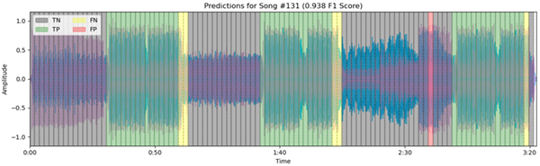
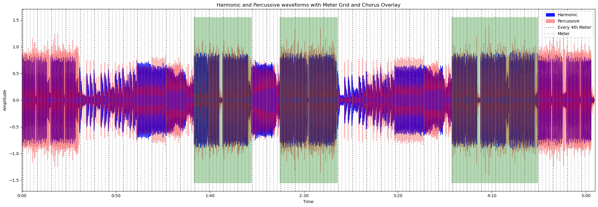
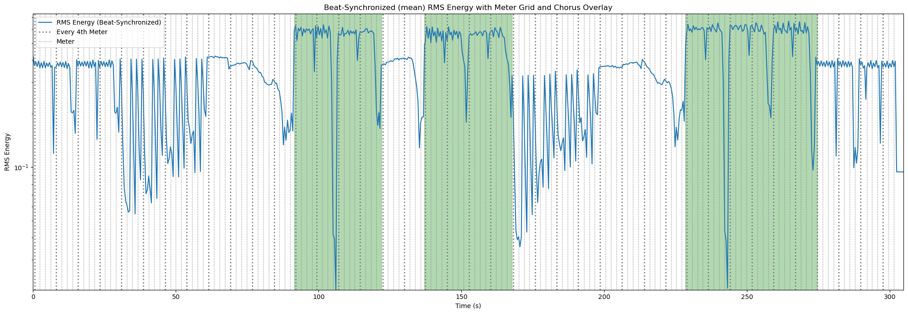
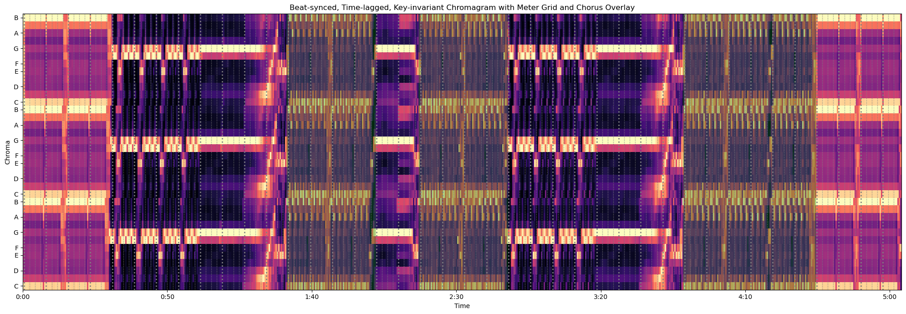
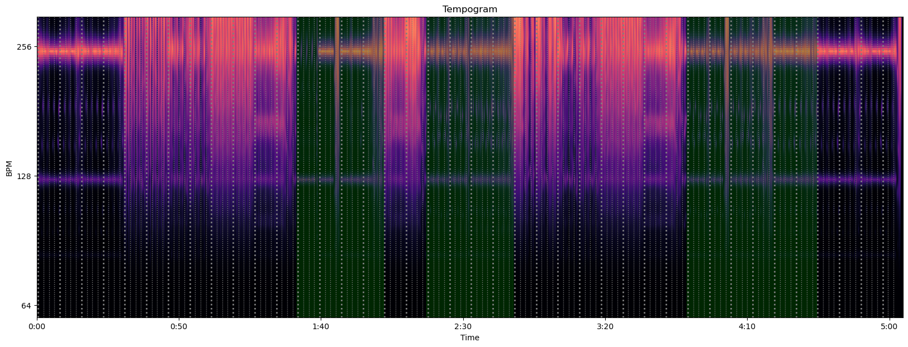
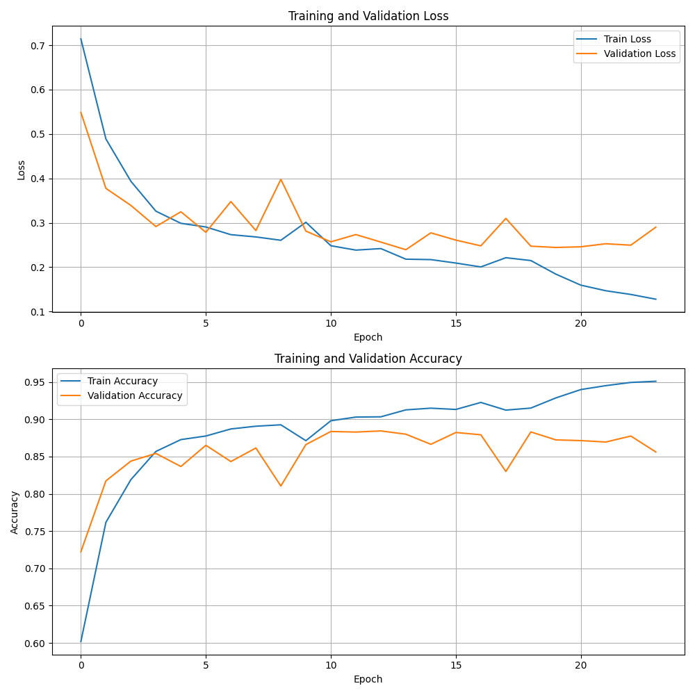
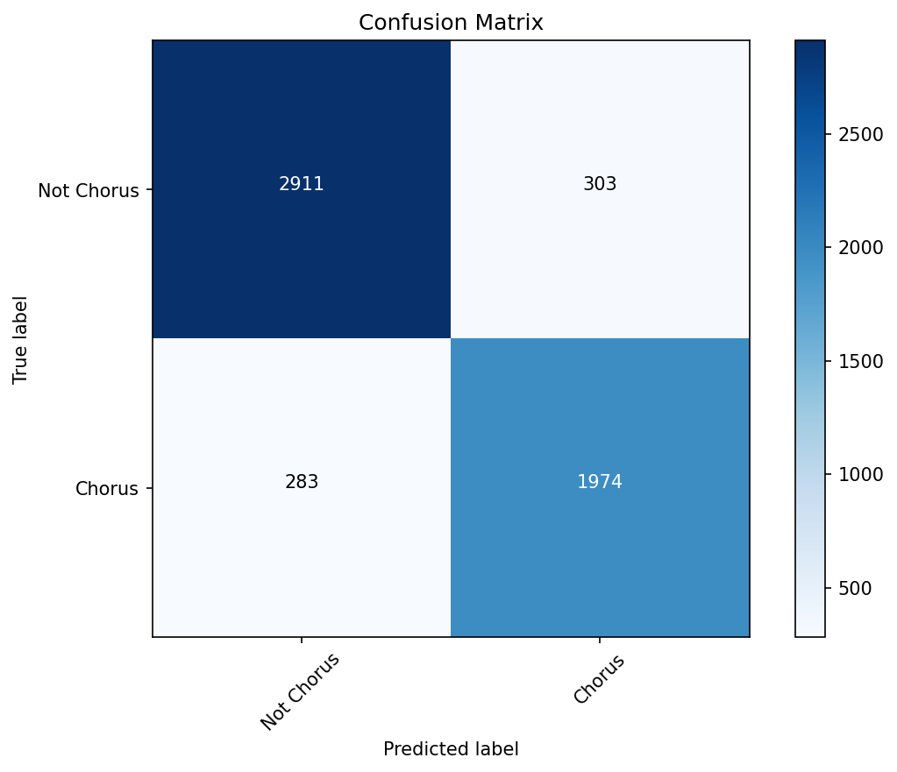

# Automated Chorus Detection [](https://github.com/dennisvdang/chorus-detection)



## Overview

A hierarchical convolutional recurrent neural network designed for detecting choruses in music recordings, implemented in PyTorch. The model was trained on 332 annotated songs from electronic music genres and achieved an F1 score of 0.871 (Precision: 0.867, Recall: 0.875) on unseen test data. For more details, scroll down to the [Project Technical Summary section](#project-technical-summary).

The original TensorFlow implementation is preserved on the [`tensorflow`](../../tree/tensorflow) branch.

## Quick Links

- [Try the model on HuggingFace Spaces](https://huggingface.co/spaces/dennisvdang/Chorus-Detection)
- [Labeled training dataset of 332 songs (audio files not included)](data/clean_labeled.csv)
- [Pre-trained model file](https://github.com/dennisvdang/chorus-detection/releases/download/pytorch-v1.0/crnn_v1.pt)
- [Original model training notebook](notebooks/Automated-Chorus-Detection.ipynb)
- [Music annotation process](docs/Data_Annotation_Guide.pdf)

## Quick Installation

```bash
# Clone repository
git clone https://github.com/dennisvdang/chorus-detection.git
cd chorus-detection

# Set up environment
conda env create -f environment.yml
conda activate chorus-detection
pip install -r requirements.txt

# With conda environment activated
# Run the web-app locally
streamlit run web/app.py
```

The pretrained model is downloaded automatically on first run.

## Project Structure

```
chorus-detection/
│
├── pytorch_core/         # Core functionality
│   ├── audio_processor.py   # Audio processing and feature extraction
│   ├── model.py             # Model loading and prediction
│   ├── models/              # Model architectures (CRNN)
│   ├── data/                # Dataset classes
│   ├── training/            # Trainer with evaluation and checkpointing
│   ├── utils.py             # Utility functions
│   └── visualization.py     # Plotting and visualization
│
├── web/                  # Web interface
│   └── app.py               # Streamlit web application
│
├── scripts/              # Preprocessing, training, and inference scripts
│   ├── preprocess.py        # Audio -> training segments and labels
│   ├── train.py             # Training entry point
│   └── inference.py         # Chorus detection on a new audio file
│
├── config/               # Model and training configuration
├── tests/                # pytest suite
├── models/               # Pre-trained models
│
├── setup.py              # Package setup
├── requirements.txt      # Package requirements
├── Dockerfile            # Docker configuration
└── docker-compose.yml    # Docker Compose configuration
```

## Project Technical Summary

### Data

The dataset consists of 332 manually labeled songs, predominantly from electronic music genres. Data preparation involved:

1. **Audio preprocessing**: Formatting songs uniformly, processing at a consistent sampling rate, trimming silence, and extracting metadata using Spotify's API. [Link to preprocessing notebook](notebooks/Preprocessing.ipynb)

2. **Manual Chorus Labeling**: Labeling the start and end timestamps of choruses following a set of guidelines. More details on the annotation process can be found in the [Annotation Guide pdf.](docs/Data_Annotation_Guide.pdf)

### Model Preprocessing

- Features such as Root Mean Squared energy, key-invariant chromagrams, Melspectrograms, MFCCs, and tempograms were extracted. These features were decomposed using Non-negative Matrix Factorization using an optimal number of components derived in our exploratory analysis.

- Songs were segmented into timesteps based on musical meters, with positional and grid encoding applied to every audio frame and meter, respectively. Songs and labels were uniformly padded and split into train/validation/test sets, processed into batch sizes of 32 using a custom generator.

Below are examples of audio feature visualizations of a song with 3 choruses (highlighted in green). The gridlines represent the musical meters, which are used to divide the song into segments; these segments then serve as the timesteps for the CRNN input.






### Model Architecture

The model employs a two-tier architecture that respects the heirarchical structure of music (frames → meters → song)

**Input Features:**

The model receives as input a song's feature vector (NMF-activated features derived from RMS, mel spectrogram, chromagram, tempogram, and MFCCs). These are computed per frame and grouped by musical meter.

**CNN Layers:**

The CNN layers (3 Conv1D + MaxPooling1D layers) apply a series of learnable filters to the input features, sliding across the time (frame) dimension within each meter segment, and outputs a single feature vector (embedding) that summarizes the temporal information found within that meter. Note that there is no information shared *between* meters at this stage; each meter's frames are processed in isolation.

**LSTM Layer:**

After the CNN layers, the sequence of meter embeddings that make up the input song is passed to a bidirectional LSTM, allowing the model to capture both past and future context across the song's structure. The LSTM outputs a sequence of hidden states, one for each meter, which are then used for final classification.

**Output Layer:**

A TimeDistributed dense layer with a sigmoid activation is applied to the LSTM outputs, producing a probability for each meter indicating the likelihood that it corresponds to a chorus section. The model is trained using a custom binary cross-entropy loss that masks out padded values, allowing the model to learn from variable-length songs.

``` python
class CRNN(nn.Module):
    """Convolutional Recurrent Neural Network for chorus detection.

    Processes audio at two time scales:
    1. CNN extracts features from frames within each meter
    2. Bidirectional LSTM models relationships between meters
    """

    def __init__(self, config):
        super().__init__()
        # CNN: Conv1D(128/256/256, kernel 3) + ReLU + MaxPool, applied per meter
        self.cnn_layers = self._build_cnn_layers()
        self.cnn_output_dim = self._calculate_cnn_output_dim()
        # BiLSTM over the sequence of meter embeddings
        self.rnn = nn.LSTM(input_size=self.cnn_output_dim, hidden_size=256,
                           bidirectional=True, batch_first=True)
        self.output_layer = nn.Linear(512, 1)
        self.sigmoid = nn.Sigmoid()

    def forward(self, x):
        # x: [batch, max_meters, max_frames, n_features]
        batch_size, max_meters, max_frames, n_features = x.shape
        # Meters that are entirely zero are padding
        mask = (x.sum(dim=(2, 3)) != 0).float().unsqueeze(-1)
        # Run the CNN over every meter independently (TimeDistributed-style)
        x = x.view(batch_size * max_meters, max_frames, n_features).transpose(1, 2)
        cnn_out = self.cnn_layers(x).reshape(batch_size, max_meters, -1)
        # Model relationships between meters across the whole song
        rnn_out, _ = self.rnn(cnn_out)
        # Per-meter chorus probability, with padding zeroed out
        return self.sigmoid(self.output_layer(rnn_out)) * mask
```

The model is trained with a masked binary cross-entropy loss that ignores padded meters (labeled -1), allowing it to learn from variable-length songs. The full implementation is in [pytorch_core/models/crnn.py](pytorch_core/models/crnn.py).

### Training

- Custom masked loss and accuracy handle padded values
- Best model saved on minimal validation loss, learning rate reduced on plateau, and early stopping
- Trained for up to 50 epochs (stopped early after 24 epochs). Training/Validation Loss and Accuracy plotted below:


### Results

The model achieved strong results on the held-out test set as shown in the summary table. Visualizations of the predictions on sample test songs are also provided and can be found in the [test_predictions folder](images/test_predictions).

| Metric         | Score  |
|----------------|--------|
| Loss           | 0.253  |
| Accuracy       | 0.893  |
| Precision      | 0.867  |
| Recall         | 0.875  |
| F1 Score       | 0.871  |



## Works in progress

- Additional training data for other musical segments (e.g. intro, pre-chorus, bridge, verse)
- Music data labeling interface for contributions

## Training Your Own Model

The implementation uses a modular architecture that makes it easy to experiment
with different model configurations, feature sets, and training parameters —
model and training parameters live in a YAML config file, with reproducible
seeded splits and checkpointing. The PyTorch port reproduces the original
TensorFlow model's performance; see
[docs/pytorch_results.md](docs/pytorch_results.md) for the full comparison
against the TensorFlow baseline.

1. **Set up the environment:**
   ```bash
   conda env create -f environment.yml
   conda activate chorus-detection
   pip install -r requirements.txt
   ```
   For CUDA training, install the matching PyTorch build, e.g.:
   ```bash
   pip install torch --index-url https://download.pytorch.org/whl/cu121
   ```

2. **Preprocess the dataset** (audio files in `data/audio/processed/{SongID}.mp3`
   plus `data/clean_labeled.csv`). This writes per-song segment and label
   pickles to `data/segments_V2/` and `data/labels_V2/`:
   ```bash
   python scripts/preprocess.py
   # smoke-test on a few songs first:
   python scripts/preprocess.py --limit 3
   ```

3. **Train the model:**
   ```bash
   python scripts/train.py --config config/default.yaml --checkpoint_dir models/pytorch
   # on an 8 GB GPU, reduce the batch size:
   python scripts/train.py --checkpoint_dir models/pytorch --batch_size 16 --device cuda
   ```

4. **Run inference on a new song:**
   ```bash
   python scripts/inference.py --audio path/to/audio.mp3 \
       --checkpoint models/pytorch/best_model.pt --output prediction.png
   ```

### Running the Tests

```bash
pip install pytest
pytest tests/ -m "not slow"   # fast unit tests
pytest tests/                 # includes the audio preprocessing integration test
```

### Future Work

- Extend to multi-class classification for all song sections (verse, chorus, bridge, etc.)
- Implement feature importance analysis
- Add support for audio augmentation

## Contributing

If you found this project interesting or informative, feel free to star the repository! Issues, pull requests, and feedback are welcome.