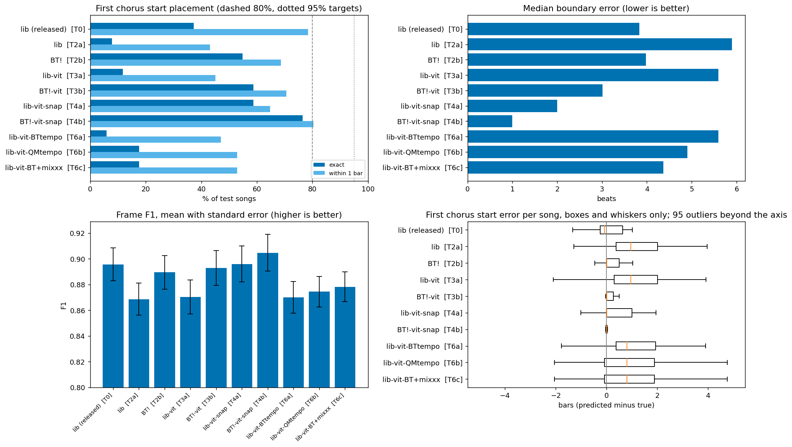

# Automated Chorus Detection [](https://github.com/dennisvdang/chorus-detection)


## Overview

A hierarchical convolutional recurrent neural network designed for detecting choruses in music recordings, implemented in PyTorch. The model was trained on 332 annotated songs from electronic music genres and achieved an F1 score of 0.871 (Precision: 0.867, Recall: 0.875) on unseen test data. The model output is reliant on the song's beat/bar grid. The current preprocessing configuration placed 76.5% of the first detected chorus start boundary exactly on the labeled bar/measure and 80.4% within one bar.

For more details, scroll down to the [Project Technical Summary section](#project-technical-summary).

The original TensorFlow implementation is preserved on the [`tensorflow`](../../tree/tensorflow) branch.

## Quick Links

- [Try the model on HuggingFace Spaces](https://huggingface.co/spaces/dennisvdang/Chorus-Detection)
- [Labeled training dataset of 332 songs (audio files not included)](data/clean_labeled.csv)
- [Pre-trained model file](https://github.com/dennisvdang/chorus-detection/releases/download/beatthis-v1.0/crnn_beatthis_v1.pt) — trained on the tracked-downbeat bar grid; see [Where the boundaries land](#where-the-boundaries-land)
- [Original model training notebook](notebooks/Automated-Chorus-Detection.ipynb)
- [Music annotation process](docs/Data_Annotation_Guide.pdf)

## Quick Installation

```bash
# Clone repository
git clone https://github.com/dennisvdang/chorus-detection.git
cd chorus-detection

# Set up environment
conda env create -f environment.yml
conda activate chorus-detection
pip install -r requirements.txt

# With conda environment activated
# Run the web-app locally
streamlit run web/app.py
```

The pretrained model is downloaded automatically on first run.

## Project Structure

```
chorus-detection/
│
├── pytorch_core/         # Core functionality
│   ├── audio_processor.py   # Audio processing and feature extraction
│   ├── model.py             # Model loading and prediction
│   ├── models/              # Model architectures (CRNN)
│   ├── data/                # Dataset classes
│   ├── training/            # Trainer with evaluation and checkpointing
│   ├── utils.py             # Utility functions
│   └── visualization.py     # Plotting and visualization
│
├── web/                  # Web interface
│   └── app.py               # Streamlit web application
│
├── scripts/              # Preprocessing, training, and inference scripts
│   ├── preprocess.py        # Audio -> training segments and labels
│   ├── train.py             # Training entry point
│   └── inference.py         # Chorus detection on a new audio file
│
├── config/               # Model and training configuration
├── tests/                # pytest suite
├── models/               # Pre-trained models
│
├── setup.py              # Package setup
├── requirements.txt      # Package requirements
├── Dockerfile            # Docker configuration
└── docker-compose.yml    # Docker Compose configuration
```

## Project Technical Summary

### Data

The dataset consists of 332 manually labeled songs, predominantly from electronic music genres. Data preparation involved:

1. **Audio preprocessing**: Formatting songs uniformly, processing at a consistent sampling rate, trimming silence, and extracting metadata using Spotify's API. [Link to dataset preparation notebook](notebooks/Dataset-Prep.ipynb)

2. **Manual Chorus Labeling**: Labeling the start and end timestamps of choruses following a set of guidelines. More details on the annotation process can be found in the [Annotation Guide pdf.](docs/Data_Annotation_Guide.pdf)

### Model Preprocessing

Preprocessing does two things: it extracts features from the audio, and it
decides where the bar lines fall. The second one turned out to matter far more
than the first, so it is described first here. See
[Where the boundaries land](#where-the-boundaries-land) for the measurements.

**Drawing the bar grid.** The model reads a song one bar at a time, so the bar
grid decides what every timestep contains and where every predicted boundary
can possibly land. Two ways of building it are implemented, and
`--grid-source` selects between them:

| Grid | How the bar lines are placed |
|---|---|
| `beat_this` (**shipped default**) | Bar lines are the downbeats tracked by [Beat This!](https://github.com/CPJKU/beat_this) (ISMIR 2024). The tracker follows the song, so tempo drift and irregular bars do not accumulate error. |
| `librosa` | One tempo and one anchor beat, extrapolated forward and backward at constant spacing and grouped into fours. This is the original behaviour. |

The extrapolated grid anchors on the first beat librosa detects and assumes
that beat is a downbeat. Measured against the labelled chorus boundaries, its
nearest bar line is a median of 0.89 beats away and only 14.8% of boundaries
fall within a quarter beat of one. The tracked downbeats are a median of 0.083
beats away, with 92.8% within a quarter beat. A grid that is a beat out of
phase displaces every prediction made on it, no matter how good the model is.

**Extracting features.** Root mean squared energy, key-invariant chromagrams,
mel spectrograms, MFCCs, and tempograms are extracted per frame, then
decomposed with Non-negative Matrix Factorization using the component count
chosen in the exploratory analysis. Frames are grouped into the bars defined
above, positional encoding is applied per frame and grid encoding per bar, and
songs and labels are padded to a uniform length before the train, validation,
and test split.

**Training data and inference must use the same grid.** A model trained on one
grid and run on the other is a train/inference mismatch, and none of the
measured numbers hold. `scripts/preprocess.py` and `scripts/inference.py` both
take `--grid-source` for this reason, and the shipped checkpoint
`crnn_beatthis_v1.pt` was built on `beat_this`.

Below are examples of audio feature visualizations of a song with 3 choruses (highlighted in green). The gridlines represent the musical meters, which are used to divide the song into segments; these segments then serve as the timesteps for the CRNN input.


### Model Architecture

The model employs a two-tier architecture that respects the heirarchical structure of music (frames → meters → song)

**Input Features:**

The model receives as input a song's feature vector (NMF-activated features derived from RMS, mel spectrogram, chromagram, tempogram, and MFCCs). These are computed per frame and grouped by musical meter.

**CNN Layers:**

The CNN layers (3 Conv1D + MaxPooling1D layers) apply a series of learnable filters to the input features, sliding across the time (frame) dimension within each meter segment, and outputs a single feature vector (embedding) that summarizes the temporal information found within that meter. Note that there is no information shared *between* meters at this stage; each meter's frames are processed in isolation.

**LSTM Layer:**

After the CNN layers, the sequence of meter embeddings that make up the input song is passed to a bidirectional LSTM, allowing the model to capture both past and future context across the song's structure. The LSTM outputs a sequence of hidden states, one for each meter, which are then used for final classification.

**Output Layer:**

A TimeDistributed dense layer with a sigmoid activation is applied to the LSTM outputs, producing a probability for each meter indicating the likelihood that it corresponds to a chorus section. The model is trained using a custom binary cross-entropy loss that masks out padded values, allowing the model to learn from variable-length songs.

``` python
class CRNN(nn.Module):
    """Convolutional Recurrent Neural Network for chorus detection.

    Processes audio at two time scales:
    1. CNN extracts features from frames within each meter
    2. Bidirectional LSTM models relationships between meters
    """

    def __init__(self, config):
        super().__init__()
        # CNN: Conv1D(128/256/256, kernel 3) + ReLU + MaxPool, applied per meter
        self.cnn_layers = self._build_cnn_layers()
        self.cnn_output_dim = self._calculate_cnn_output_dim()
        # BiLSTM over the sequence of meter embeddings
        self.rnn = nn.LSTM(input_size=self.cnn_output_dim, hidden_size=256,
                           bidirectional=True, batch_first=True)
        self.output_layer = nn.Linear(512, 1)
        self.sigmoid = nn.Sigmoid()

    def forward(self, x):
        # x: [batch, max_meters, max_frames, n_features]
        batch_size, max_meters, max_frames, n_features = x.shape
        # Meters that are entirely zero are padding
        mask = (x.sum(dim=(2, 3)) != 0).float().unsqueeze(-1)
        # Run the CNN over every meter independently (TimeDistributed-style)
        x = x.view(batch_size * max_meters, max_frames, n_features).transpose(1, 2)
        cnn_out = self.cnn_layers(x).reshape(batch_size, max_meters, -1)
        # Model relationships between meters across the whole song
        rnn_out, _ = self.rnn(cnn_out)
        # Per-meter chorus probability, with padding zeroed out
        return self.sigmoid(self.output_layer(rnn_out)) * mask
```

The model is trained with a masked binary cross-entropy loss that ignores padded meters (labeled -1), allowing it to learn from variable-length songs. The full implementation is in [pytorch_core/models/crnn.py](pytorch_core/models/crnn.py).

### Training

- Custom masked loss and accuracy handle padded values
- Best model saved on minimal validation loss, learning rate reduced on plateau, and early stopping
- Trained for up to 50 epochs (stopped early after 24 epochs). Training/Validation Loss and Accuracy plotted below:


### Post-processing

The model emits one chorus probability per bar. Two steps turn that into
timestamps, and both are on by default.

**Decoding.** `--decode viterbi` reads the bar sequence as a two-state hidden
Markov model, where each bar pays a cost to be labelled chorus or not, plus a
fixed penalty for switching state between adjacent bars. Viterbi finds the
lowest-cost path, and runs shorter than four bars are then dissolved, which
encodes the prior that a chorus spans whole phrases. The alternative,
`--decode smooth`, simply thresholds at 0.5 and drops runs shorter than two
bars, with no notion of how likely a section change is. The implementation is
in `pytorch_core/decoding.py`.

**Snapping.** Each decoded boundary is then moved to a downbeat within plus or
minus two bars, choosing the one with the strongest RMS energy rise for a
chorus start or the strongest fall for a chorus end. A drop predicted a bar
early therefore still lands on the actual energy onset. `--no-snap` turns this
off, and `--snap-window` changes the search width.

### Results

The model achieved strong results on the held-out test set as shown in the summary table. Visualizations of the predictions on sample test songs are also provided and can be found in the [test_predictions folder](images/test_predictions).

| Metric         | Score  |
|----------------|--------|
| Loss           | 0.253  |
| Accuracy       | 0.893  |
| Precision      | 0.867  |
| Recall         | 0.875  |
| F1 Score       | 0.871  |


### Where the boundaries land

The metrics above count how much chorus the model finds. They do not say where
the boundaries land, and for beat-matching that is the number that matters: an
incoming track is aligned to the first chorus start.

**The bar grid is the dominant factor, by a wide margin.** Retraining the same
model on the same data with the same decoder, changing only how bar lines are
drawn, moved exact placement of the first chorus start from **7.8% to 54.9%**.
No other single change came close.

To measure this, ten configurations were scored over the same 51 held-out songs
on 2026-08-17, varying the bar grid, the decoder, and whether boundaries are
snapped to tracked downbeats. Every configuration is in
[results/vast-run/trials.csv](results/vast-run/trials.csv) and the per-song
numbers behind them in
[results/vast-run/trial_songs.csv](results/vast-run/trial_songs.csv).

| Configuration | First chorus start exact | Within 1 bar | Median boundary error |
|---|---|---|---|
| Extrapolated grid, threshold-and-smooth | 7.8% | 43.1% | 5.9 beats |
| **Tracked downbeats, threshold-and-smooth** | **54.9%** | 68.6% | 4.0 beats |
| Extrapolated grid, Viterbi | 11.8% | 45.1% | 5.6 beats |
| Extrapolated grid, Viterbi, snapping | 58.8% | 64.7% | 2.0 beats |
| Tracked downbeats, Viterbi | 58.8% | 70.6% | 3.0 beats |
| **Tracked downbeats, Viterbi, snapping** | **76.5%** | **80.4%** | **1.0 beat** |

The first two rows are the grid comparison on its own: same model architecture,
same training data, same decoder, no snapping, only the bar lines differ.

**The best configuration found was the tracked-downbeat grid, Viterbi decoding,
and snapping: 76.5% exact, 80.4% within one bar, and the lowest boundary error
at 1.0 beat.** That is what ships. The settings live in
`pytorch_core/defaults.py` and `crnn_beatthis_v1.pt` is the checkpoint trained
on that grid. `tests/test_inference_defaults.py` reads the CSV above and fails
if the shipped defaults stop matching the configuration that measured best.



Two further findings:

- **Decoding and snapping help, but only on top of a correct grid.** Viterbi
  decoding alone moved the extrapolated grid from 7.8% to 11.8%. Snapping is
  worth more than decoding, because it corrects grid phase error directly, but
  even the extrapolated grid with both applied (58.8%) does not reach the
  tracked-downbeat grid with both applied (76.5%).
- **Frame F1 does not discriminate.** Every configuration scores between 0.869
  and 0.905 with overlapping error bars. All of them find similar *amounts* of
  chorus and differ only in where the boundaries land, so choosing on F1 alone
  would have picked any of them, including the worst.

#### Limitations

76.5% exact falls short of the 80% target, and 80.4% within one bar falls well
short of the 95% target.

The error that remains is not a misplaced boundary. Of the 51 test songs, 39
are exact and 2 are within one bar. Of the 10 that miss, six miss by more than
four bars, which means the model marked a different section of the song rather
than the wrong edge of the right one. Correcting all six would give 92.2%
exact and 96.1% within one bar. The 95% target is therefore reachable only by
solving wrong-section detection outright; no improvement to boundary placement
gets there. That is a separate problem and needs its own investigation.


## Works in progress

- Additional training data for other musical segments (e.g. intro, pre-chorus, bridge, verse)
- Music data labeling interface for contributions

## Training Your Own Model

The implementation uses a modular architecture that makes it easy to experiment
with different model configurations, feature sets, and training parameters —
model and training parameters live in a YAML config file, with reproducible
seeded splits and checkpointing. The PyTorch port reproduces the original
TensorFlow model's performance; see
[docs/pytorch_results.md](docs/pytorch_results.md) for the full comparison
against the TensorFlow baseline.

1. **Set up the environment:**
   ```bash
   conda env create -f environment.yml
   conda activate chorus-detection
   pip install -r requirements.txt
   ```
   For CUDA training, install the matching PyTorch build, e.g.:
   ```bash
   pip install torch --index-url https://download.pytorch.org/whl/cu121
   ```

2. **Preprocess the dataset** (audio files in `data/audio/processed/{SongID}.mp3`
   plus `data/clean_labeled.csv`). This writes per-song segment and label
   pickles to `data/segments_V2/` and `data/labels_V2/`:
   ```bash
   python scripts/preprocess.py --grid-source beat_this
   # smoke-test on a few songs first:
   python scripts/preprocess.py --grid-source beat_this --limit 3
   ```

   `beat_this` is the default, so the flag is optional. It is written out here
   because this choice has to match the one used at inference in step 4. A
   model trained on one bar grid and run on the other is a train/inference
   mismatch. To train on the extrapolated grid instead, pass
   `--grid-source librosa` here **and** at inference.

3. **Train the model:**
   ```bash
   python scripts/train.py --config config/default.yaml --checkpoint_dir models/pytorch
   # on an 8 GB GPU, reduce the batch size:
   python scripts/train.py --checkpoint_dir models/pytorch --batch_size 16 --device cuda
   ```

4. **Run inference on a new song:**
   ```bash
   python scripts/inference.py --audio path/to/audio.mp3 --output prediction.png
   ```

   With no `--checkpoint`, this uses the shipped `crnn_beatthis_v1.pt`,
   downloading it from the GitHub release on first run. To read a
   checkpoint you trained yourself, pass both the path and the bar grid it
   was trained on:

   ```bash
   python scripts/inference.py --audio path/to/audio.mp3 \
       --checkpoint models/pytorch/best_model.pt --grid-source librosa
   ```

   Three defaults come from the ablation in
   [Where the boundaries land](#where-the-boundaries-land), and each can be
   turned off:

   - `--grid-source beat_this` draws bar lines from downbeats tracked by
     [Beat This!](https://github.com/CPJKU/beat_this) instead of extrapolating
     one tempo across the song. Pass `--grid-source librosa` for the old grid,
     but only with a checkpoint trained on it.
   - `--decode viterbi` reads the per-bar probabilities as a two-state HMM and
     takes the lowest-cost path, instead of thresholding at 0.5. Pass
     `--decode smooth` for the old decoder.
   - Snapping then moves each boundary to a downbeat within ±2 bars
     (`--snap-window`), choosing the one with the strongest RMS energy rise for
     a chorus start or fall for a chorus end, so a drop predicted a bar early
     still lands on the actual energy onset. Pass `--no-snap` to disable it.

   `requirements.txt` installs the Beat This! tracker. Without it the default
   bar grid cannot be built, and inference stops and reports that as the cause.

### Running the Tests

```bash
pip install pytest
pytest tests/ -m "not slow"   # fast unit tests
pytest tests/                 # includes the audio preprocessing integration test
```

### Future Work

- Extend to multi-class classification for all song sections (verse, chorus, bridge, etc.)
- Implement feature importance analysis
- Add support for audio augmentation

## Contributing

If you found this project interesting or informative, feel free to star the repository! Issues, pull requests, and feedback are welcome.